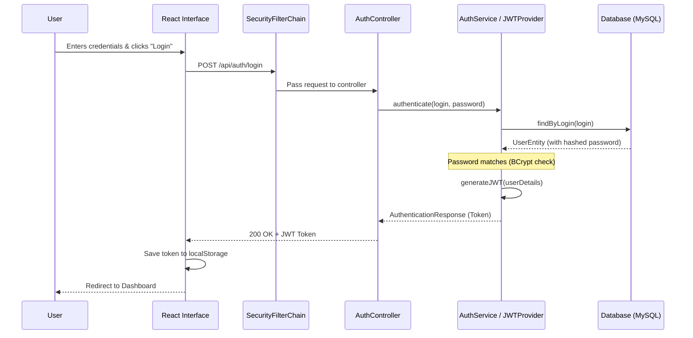
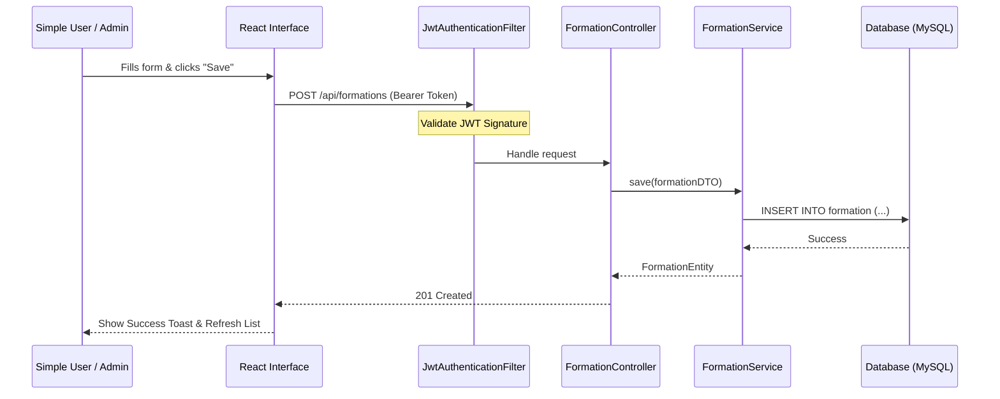
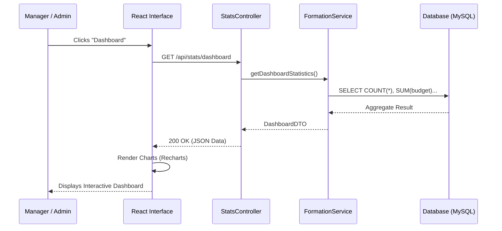
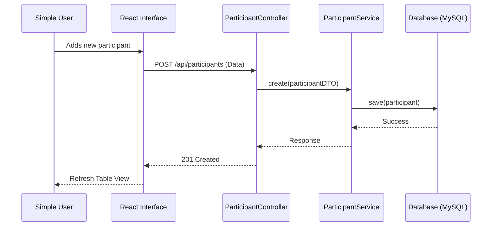
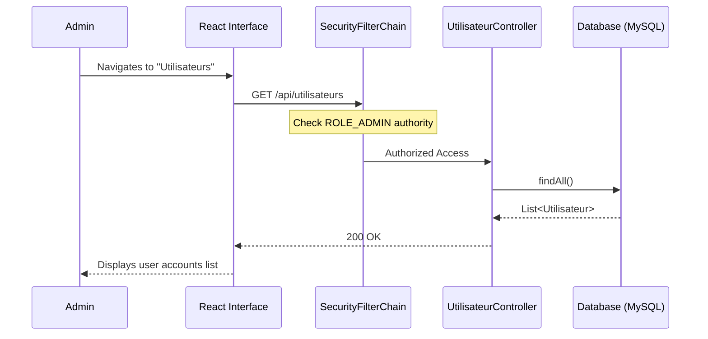

# TrainingMS Sequence Diagrams (Mermaid)

These diagrams describe the dynamic interactions between the actors, the React frontend, and the Spring Boot backend.

## 1. User Authentication (Login)

## 2. Managing Formations (Creation Example)

## 3. Consulting Dashboard (Statistics)

## 4. Registering a Participant

## 5. User Management (Admin Only)

